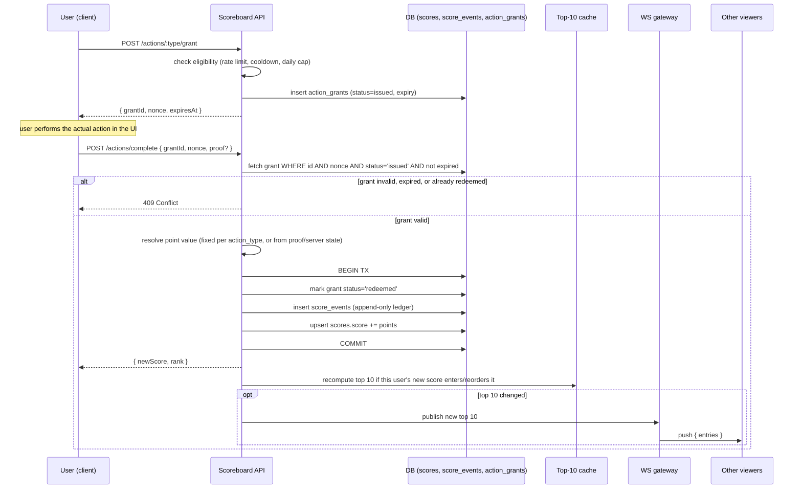

# Problem 6 — Scoreboard API Module Spec

Backend module for a live top-10 scoreboard. A user performs an action in the
product; on completion the client calls our API to award score; the
scoreboard updates in real time for every connected viewer; no client can
grant itself score it didn't earn.

## 1. Scope

- Persist per-user scores.
- Serve the current top 10 or updates it live to viewers.
- Accept "user completed an action worth points" events from the client,
  but never trust the client for *how much* or *whether* it happened.

Out of scope (owned by other modules, referenced only where the interface
matters): what the scoreable action actually is, the action's own business
logic/UI, user auth/session issuance (we consume it, not issue it).

## 2. Data model

```
users                    scores                        action_grants
---------------          ---------------------          -----------------------------
id (PK)                  user_id (PK, FK -> users)      id (PK)
...                      score (bigint, default 0)      user_id (FK -> users)
                         updated_at                     action_type
                                                         nonce (unique)
score_events                                             status (issued|redeemed|expired)
-----------------------------                            issued_at
id (PK)                                                  expires_at
user_id (FK -> users)                                    redeemed_at
action_type
points (int)
action_grant_id (FK -> action_grants, unique)
created_at
```

- `score_events` is an append-only ledger — the source of truth. `scores.score`
  is a denormalized running total kept in sync in the same transaction as the
  insert, so a read-heavy scoreboard never has to `SUM()` the ledger.
- `action_grants` is what makes an award redeemable exactly once (see §4).

## 3. API

All endpoints require an authenticated session (bearer token / cookie issued
by the existing auth module). All are versioned under `/api/v1`.

| Method | Path                          | Purpose                                                        |
|--------|-------------------------------|-----------------------------------------------------------------|
| POST   | `/actions/:type/grant`        | Client asks to start a scoreable action; server issues a one-time grant token |
| POST   | `/actions/complete`           | Client reports the action finished; redeems the grant, awards points |
| GET    | `/scoreboard/top`             | Current top 10 (fallback for clients without a live connection) |
| WS     | `/scoreboard/live`            | Subscribe to push updates whenever the top 10 changes           |

### `POST /actions/:type/grant`

Called when the user *starts* the action (e.g. opens the game, clicks
"begin"). Server decides if this user/action is currently eligible (rate
limits, cooldowns, daily caps) and, if so, issues a short-lived, single-use
grant.

Response: `{ grantId, nonce, expiresAt }`

### `POST /actions/complete`

Body: `{ grantId, nonce, proof? }`

`proof` is action-specific evidence the module can check server-side when the
action has server-verifiable state (e.g. a game server that already knows
the real outcome, an order that was actually placed). Where no such state
exists, the grant itself — issued only when the server already agreed the
action was eligible — is the control; the client never supplies the point
value.

Server logic (see §4 for the full flow): validate grant → run the
action-specific point-value rule → write `score_events` + update `scores` in
one transaction → invalidate grant → publish the delta.

Response: `{ newScore, rank }`

### `GET /scoreboard/top`

Response: `{ entries: [{ userId, displayName, score, rank }, ...10] }`. Served
from a cache (see §5), not a live `ORDER BY score DESC LIMIT 10` on every hit.

### `WS /scoreboard/live`

On connect: server sends the current top 10. Thereafter: server pushes
`{ entries: [...] }` only when the top-10 set or ordering actually changes —
not on every score event, so a hot streak doesn't flood every viewer.

## 4. Execution flow



## 5. Real-time delivery

- WS gateway is a thin pub/sub layer (e.g. Redis pub/sub or the DB's
  `LISTEN/NOTIFY` behind it) — the API process publishes a "top 10 changed"
  event; gateway instances fan it out to their connected sockets. This lets
  the API and the WS gateway scale independently.
- The top-10 cache (Redis, TTL as a safety net) is invalidated/recomputed
  only on writes that could plausibly affect the top 10 — i.e. any score
  update where `newScore` >= current 10th-place score. Everyone else's score
  going up doesn't touch it.
- Clients without a live connection just poll `GET /scoreboard/top`, which
  reads the same cache.

## 6. Anti-abuse / integrity

The core rule: **the client can request permission to earn points and can
report completion, but it never states how many points it gets.**

1. **Grant/redeem, not "add points".** `/actions/complete` never accepts a
   score delta from the client. The point value comes from server-side
   config per `action_type` (or server-verified `proof` when the action has
   its own authoritative state, e.g. a match result already recorded by a
   game service).
2. **One-time, expiring, nonce-bound grants.** A grant is redeemable exactly
   once (`status` transition is atomic in the same transaction, guarded by a
   unique index on `action_grants.id` + a `WHERE status='issued'` check).
   Replaying a captured request fails once it's already redeemed. Expiry
   caps how long a leaked grant is useful.
3. **Rate limits and daily/session caps** at grant-issuance time, keyed by
   user and action_type — bounds the maximum possible score inflation even
   if every grant issued were legitimately redeemed back-to-back.
4. **Append-only ledger.** `score_events` records every award with its
   grant, so `scores.score` is always reconstructable/auditable; a support
   or fraud team can diff the denormalized total against the ledger to catch
   any drift (bug or tampering) automatically.
5. **Anomaly monitoring.** Alert on per-user score velocity outliers, unusual
   grant-issue-to-redeem timing (near-zero = likely scripted), or a spike in
   409s (replay attempts). Feed into existing abuse tooling rather than
   building a bespoke fraud system here.
6. **Standard transport/session hardening** (HTTPS, existing session auth,
   CSRF protection on the grant/complete endpoints) — not scoreboard-specific
   but a prerequisite.

This design does not fully prevent a user from legitimately completing the
action many times in automatable ways (e.g. scripting genuine plays) — that's
a product/rate-limit tuning question, not something this module can solve by
itself. It does prevent a client from forging point values or replaying a
single completion into repeated score.

## 7. Suggested improvements for the implementing team

- Confirm whether any action types have their own server-side truth (a game
  server, an order service) — for those, `proof` verification should call
  that service directly rather than trusting the grant alone.
- Decide the eviction/backfill policy for `action_grants` (e.g. a cron to
  expire stale `issued` rows) so the table doesn't grow unbounded.
- If leaderboards need to be per-scope (weekly, per-region, per-game-mode)
  rather than global all-time, that changes the cache key and the
  `scores` table shape — worth deciding before, not after, launch.
- Consider signing the WS push payload or scoping it to authenticated
  connections only if scores are considered sensitive per-user data.
